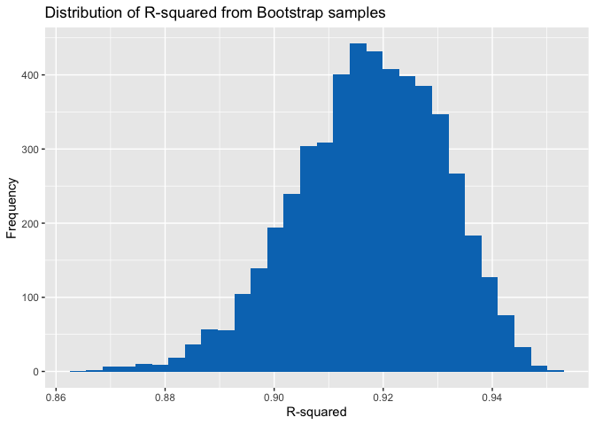
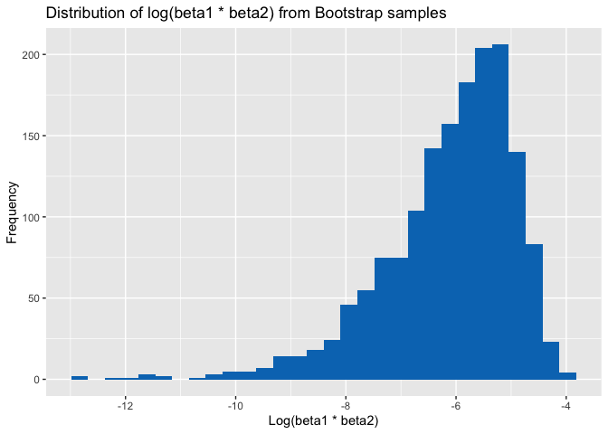
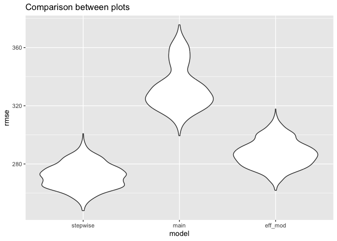

p8105_hw6_rl3411
================
rl3411
2023-11-17

``` r
library(tidyverse)
```

    ## ── Attaching core tidyverse packages ──────────────────────── tidyverse 2.0.0 ──
    ## ✔ dplyr     1.1.3          ✔ readr     2.1.4     
    ## ✔ forcats   1.0.0          ✔ stringr   1.5.0     
    ## ✔ ggplot2   3.4.3          ✔ tibble    3.2.1.9006
    ## ✔ lubridate 1.9.2          ✔ tidyr     1.3.0     
    ## ✔ purrr     1.0.2          
    ## ── Conflicts ────────────────────────────────────────── tidyverse_conflicts() ──
    ## ✖ dplyr::filter() masks stats::filter()
    ## ✖ dplyr::lag()    masks stats::lag()
    ## ℹ Use the conflicted package (<http://conflicted.r-lib.org/>) to force all conflicts to become errors

``` r
library(modelr)
```

# Problem 1

For the homicide data, we first create a `city_state` variable, then
change `victim_age` to numeric, modify `victim_race` to have categories
`white` and `non-white` with `white` as the reference category, then
create a `resolution` variable indicating whether the homicide is
solved. Lastly, we filtered out the following cities: Tulsa, AL; Dallas,
TX; Phoenix, AZ; and Kansas City, MO; and we retained only the variables
`city_state`, `resolution`, `victim_age`, `victim_sex`, and
`victim_race`.

``` r
hom_df = 
  read_csv("homicide-data.csv", na = c("", "NA", "Unknown")) |> 
  mutate(
    city_state = str_c(city, state, sep = ", "),
    victim_age = as.numeric(victim_age),
    resolution = case_when(
      disposition == "Closed without arrest" ~ 0,
      disposition == "Open/No arrest"        ~ 0,
      disposition == "Closed by arrest"      ~ 1)
  ) |> 
  filter(victim_race %in% c("White", "Black")) |> 
  filter(!(city_state %in% c("Tulsa, AL", "Dallas, TX", "Phoenix, AZ", "Kansas City, MO"))) |> 
  select(city_state, resolution, victim_age, victim_sex, victim_race)
```

    ## Rows: 52179 Columns: 12
    ## ── Column specification ────────────────────────────────────────────────────────
    ## Delimiter: ","
    ## chr (8): uid, victim_last, victim_first, victim_race, victim_sex, city, stat...
    ## dbl (4): reported_date, victim_age, lat, lon
    ## 
    ## ℹ Use `spec()` to retrieve the full column specification for this data.
    ## ℹ Specify the column types or set `show_col_types = FALSE` to quiet this message.

Once that is done, we fit a logistic regression model using only data
from Baltimore, MD. We model `resolved` as the outcome and `victim_age`,
`victim_sex`, and `victim_race` as predictors. We save the output as
`baltimore_glm` so that we can apply `broom::tidy` to this object and
obtain the estimate and confidence interval of the adjusted odds ratio
for solving homicides comparing non-white victims to white victims.

``` r
baltimore_glm = 
  filter(hom_df, city_state == "Baltimore, MD") |> 
  glm(resolution ~ victim_age + victim_sex + victim_race, family = binomial(), data = _)

baltimore_glm |> 
  broom::tidy() |> 
  mutate(
    OR = exp(estimate), 
    OR_CI_upper = exp(estimate + 1.96 * std.error),
    OR_CI_lower = exp(estimate - 1.96 * std.error)) |> 
  filter(term == "victim_sexMale") |> 
  select(OR, OR_CI_lower, OR_CI_upper) |>
  knitr::kable(digits = 3)
```

|    OR | OR_CI_lower | OR_CI_upper |
|------:|------------:|------------:|
| 0.426 |       0.325 |       0.558 |

Below, by incorporating `nest()`, `map()`, and `unnest()` into the
preceding Baltimore-specific code, we fit a model for each of the
cities, and extract the adjusted odds ratio (and CI) for solving
homicides comparing non-white victims to white victims. We show the
first 5 rows of the resulting dataframe of model results.

``` r
model_results = 
  hom_df |> 
  nest(data = -city_state) |> 
  mutate(
    models = map(data, \(df) glm(resolution ~ victim_age + victim_sex + victim_race, 
                             family = binomial(), data = df)),
    tidy_models = map(models, broom::tidy)) |> 
  select(-models, -data) |> 
  unnest(cols = tidy_models) |> 
  mutate(
    OR = exp(estimate), 
    OR_CI_upper = exp(estimate + 1.96 * std.error),
    OR_CI_lower = exp(estimate - 1.96 * std.error)) |> 
  filter(term == "victim_sexMale") |> 
  select(city_state, OR, OR_CI_lower, OR_CI_upper)

model_results |>
  slice(1:5) |> 
  knitr::kable(digits = 3)
```

| city_state      |    OR | OR_CI_lower | OR_CI_upper |
|:----------------|------:|------------:|------------:|
| Albuquerque, NM | 1.767 |       0.831 |       3.761 |
| Atlanta, GA     | 1.000 |       0.684 |       1.463 |
| Baltimore, MD   | 0.426 |       0.325 |       0.558 |
| Baton Rouge, LA | 0.381 |       0.209 |       0.695 |
| Birmingham, AL  | 0.870 |       0.574 |       1.318 |

Below we generate a plot of the estimated ORs and CIs for each city,
ordered by magnitude of the OR from smallest to largest. From this plot
we see that most cities have odds ratios that are smaller than 1,
suggesting that crimes with male victims have smaller odds of resolution
compared to crimes with female victims after adjusting for victim age
and race. This disparity is strongest in New yrok. In roughly half of
these cities, confidence intervals are narrow and do not contain 1,
suggesting a significant difference in resolution rates by sex after
adjustment for victim age and race.

``` r
model_results |> 
  mutate(city_state = fct_reorder(city_state, OR)) |> 
  ggplot(aes(x = city_state, y = OR)) + 
  geom_point() + 
  geom_errorbar(aes(ymin = OR_CI_lower, ymax = OR_CI_upper)) + 
  theme(axis.text.x = element_text(angle = 90, hjust = 1))
```

<!-- -->

# Problem 2

Let’s first load the weather data.

``` r
weather_df = 
  rnoaa::meteo_pull_monitors(
    c("USW00094728"),
    var = c("PRCP", "TMIN", "TMAX"), 
    date_min = "2022-01-01",
    date_max = "2022-12-31") |>
  mutate(
    name = recode(id, USW00094728 = "CentralPark_NY"),
    tmin = tmin / 10,
    tmax = tmax / 10) |>
  select(name, id, everything())
```

    ## using cached file: /Users/rujinlim/Library/Caches/org.R-project.R/R/rnoaa/noaa_ghcnd/USW00094728.dly

    ## date created (size, mb): 2023-09-28 10:20:02.328587 (8.524)

    ## file min/max dates: 1869-01-01 / 2023-09-30

Now, we create a function that generates a bootstrap sample of the
model, and creates a tibble containing the $R^2$ value as well as a
$\log(\beta_1*\beta_2)$ value. Because the values for $\beta$ contains
negative values, these will produce NaNs when we take the log.

``` r
boot_sample = function(df){
  
  boot_samp = sample_frac(df, replace = TRUE) 
  model = lm(tmax ~ tmin + prcp, data = boot_samp)
  
  r2 =  model |> 
    broom::glance() |> 
    select(r.squared)
  
  lgb1b2 = model |> 
    broom::tidy() |> 
    filter(term %in% c("tmin", "prcp")) |>
    select(term, estimate) |> 
    pivot_wider(names_from = term,
                values_from = estimate) |> 
    mutate(logb1b2 = log(tmin * prcp)) |> 
    select(logb1b2)
  
  tibble(r2, lgb1b2)
}
```

We then use this function to create 5000 bootstrap samples for producing
estimates of those two quantities.

``` r
boot_straps = 
  tibble(strap_number = 1:5000) |> 
  mutate(
    strap_sample = map(strap_number, \(i) boot_sample(df = weather_df))) |> 
  unnest(strap_sample)
```

    ## Warning: There were 3376 warnings in `mutate()`.
    ## The first warning was:
    ## ℹ In argument: `logb1b2 = log(tmin * prcp)`.
    ## Caused by warning:
    ## ! There was 1 warning in `mutate()`.
    ## ℹ In argument: `logb1b2 = log(tmin * prcp)`.
    ## Caused by warning in `log()`:
    ## ! NaNs produced
    ## ℹ Run `dplyr::last_dplyr_warnings()` to see the 3375 remaining warnings.

Let’s now look at the distribution of these estimates. The distribution
of $R^2$ is slightly left skewed, with an average of around 0.92.
However, the distribution of $\log(\beta_1*\beta_2)$ looks very left
skewed, with an average of around -6.

``` r
boot_straps |> 
  ggplot(aes(x = r.squared)) +
  geom_histogram(fill = "#0077BE") + 
  labs(
    title = "Distribution of R-squared from Bootstrap samples",
    x = "R-squared",
    y = "Frequency"
  )
```

    ## `stat_bin()` using `bins = 30`. Pick better value with `binwidth`.

<!-- -->

``` r
boot_straps |> 
  drop_na(logb1b2) |> 
  ggplot(aes(x = logb1b2)) +
  geom_histogram(fill = "#0077BE") + 
  labs(
    title = "Distribution of log(beta1 * beta2) from Bootstrap samples",
    x = "Log(beta1 * beta2)",
    y = "Frequency"
  ) 
```

    ## `stat_bin()` using `bins = 30`. Pick better value with `binwidth`.

<!-- -->

Using the 5000 bootstrap estimates, we can identify the 95% confidence
interval for $R^2$ and $log(\beta_1∗\beta_2)$ using the `quantile()`
function.

``` r
boot_straps |> 
  pivot_longer(
    r.squared:logb1b2,
    names_to = "variable",
    values_to = "estimate"
  ) |> 
  group_by(variable) |> 
  summarize(
    lower_CI = quantile(estimate, 0.025, na.rm = TRUE),
    upper_CI = quantile(estimate, 0.975, na.rm = TRUE)
  ) |> 
  knitr::kable()
```

| variable  |   lower_CI |   upper_CI |
|:----------|-----------:|-----------:|
| logb1b2   | -9.2196432 | -4.5755597 |
| r.squared |  0.8885985 |  0.9398065 |

# Problem 3

Firstly, let’s load and clean the data. When cleaning, we change the
variables `babysex`, `frace`, `mrace` and `malform` to factors. There is
no missing data in this dataset.

``` r
bw_df = read_csv("birthweight.csv") |> 
  mutate(
    babysex = as.factor(case_match(
      babysex,
      1 ~ "male",
      2 ~ "female")),
    frace = as.factor(case_match(
      frace,
      1 ~ "white", 
      2 ~ "black", 
      3 ~ "asian", 
      4 ~ "puerto rican", 
      8 ~ "other", 
      9 ~ "unknown")),
    mrace = as.factor(case_match(
      mrace,
      1 ~ "white", 
      2 ~ "black", 
      3 ~ "asian", 
      4 ~ "puerto rican", 
      8 ~ "other")),
    malform = as.factor(case_match(
      malform,
      0 ~ "absent", 
      1 ~ "present")))
```

    ## Rows: 4342 Columns: 20
    ## ── Column specification ────────────────────────────────────────────────────────
    ## Delimiter: ","
    ## dbl (20): babysex, bhead, blength, bwt, delwt, fincome, frace, gaweeks, malf...
    ## 
    ## ℹ Use `spec()` to retrieve the full column specification for this data.
    ## ℹ Specify the column types or set `show_col_types = FALSE` to quiet this message.

To build a model, let’s use the `stepAIC()` function in the `MASS`
package to carry out model building with a stepwise regression approach
as learned in the P8130 class, following the guidelines
\[here\](<http://www.sthda.com/english/articles/37-model-selection-essentials-in-r/154-stepwise-regression-essentials-in-r/#>:~:text=The%20stepwise%20regression%20(or%20stepwise,model%20that%20lowers%20prediction%20error.).

``` r
full_model = lm(bwt ~ ., data = bw_df)
step_model = MASS::stepAIC(full_model, direction = "both", trace = F)
```

We can look at the estimates of the variables here.

``` r
step_model |> 
  broom::tidy() |> 
  knitr::kable(digits = 3)
```

| term              |  estimate | std.error | statistic | p.value |
|:------------------|----------:|----------:|----------:|--------:|
| (Intercept)       | -6145.151 |   141.950 |   -43.291 |   0.000 |
| babysexmale       |   -28.558 |     8.455 |    -3.378 |   0.001 |
| bhead             |   130.777 |     3.447 |    37.944 |   0.000 |
| blength           |    74.947 |     2.019 |    37.120 |   0.000 |
| delwt             |     4.107 |     0.392 |    10.475 |   0.000 |
| fincome           |     0.318 |     0.175 |     1.820 |   0.069 |
| gaweeks           |    11.592 |     1.462 |     7.929 |   0.000 |
| mheight           |     6.594 |     1.785 |     3.694 |   0.000 |
| mraceblack        |   -63.906 |    42.366 |    -1.508 |   0.132 |
| mracepuerto rican |   -25.791 |    45.350 |    -0.569 |   0.570 |
| mracewhite        |    74.887 |    42.315 |     1.770 |   0.077 |
| parity            |    96.305 |    40.336 |     2.388 |   0.017 |
| ppwt              |    -2.676 |     0.427 |    -6.261 |   0.000 |
| smoken            |    -4.843 |     0.586 |    -8.271 |   0.000 |

And we can look at how fell the model fits here. A $R^2$ value of 0.718
indicates a pretty decent fit.

``` r
step_model |> 
  broom::glance() |> 
  knitr::kable(digits = 3)
```

| r.squared | adj.r.squared |   sigma | statistic | p.value |  df |    logLik |      AIC |      BIC |  deviance | df.residual | nobs |
|----------:|--------------:|--------:|----------:|--------:|----:|----------:|---------:|---------:|----------:|------------:|-----:|
|     0.718 |         0.717 | 272.333 |   848.073 |       0 |  13 | -30499.72 | 61029.44 | 61125.08 | 320986412 |        4328 | 4342 |

To look at how well this model fits, let’s show a plot of model
residuals against fitted values. We can see that for extremely low
predicted values of birth weight, the model fails to perform as well but
for the large cluster of points, the model fit is reasonable.

``` r
bw_df |> 
  add_residuals(step_model) |> 
  add_predictions(step_model) |> 
  ggplot(aes(x = pred, y = resid)) + 
  geom_point() +
  geom_smooth() +
  labs(title = "Model residuals vs. fitted values",
       x = "Predicted values",
       y = "Residuals")
```

    ## `geom_smooth()` using method = 'gam' and formula = 'y ~ s(x, bs = "cs")'

<!-- -->

Let’s now build two more models to compare with. One using length at
birth and gestational age as predictors and one using head
circumference, length, sex, and all interactions between these.

``` r
model2 = lm(bwt ~ blength + gaweeks, data = bw_df)
model3 = lm(bwt ~ bhead*blength*babysex, data = bw_df)
```

Let’s now conduct cross-validation of 1000 samples and see how the
models compare by looking at the RMSE.

``` r
cv_df = 
  bw_df |>
  crossv_mc(1000) |> 
  mutate(
    train = map(train, as_tibble),
    test = map(test, as_tibble),
    stepwise_model = map(train, \(df) step_model),
    main_eff_model = map(train, \(df) model2),
    eff_mod_model = map(train, \(df) model3)
  ) |> 
  mutate(
    rmse_stepwise = map2_dbl(stepwise_model, test, \(mod, df) rmse(model = mod, data = df)),
    rmse_main = map2_dbl(main_eff_model, test, \(mod, df) rmse(model = mod, data = df)),
    rmse_eff_mod = map2_dbl(eff_mod_model, test,\(mod, df) rmse(model = mod, data = df))
  )
  
cv_df |> 
  select(starts_with("rmse")) |> 
  pivot_longer(
    everything(),
    names_to = "model", 
    values_to = "rmse",
    names_prefix = "rmse_") |> 
  mutate(model = fct_inorder(model)) |> 
  ggplot(aes(x = model, y = rmse)) + 
  geom_violin() +
  labs(title = "Comparison between plots")
```

<!-- -->

Looking at this violin plot, we can see that the stepwise model has the
lowest RMSE, followed by the model with interaction terms of `bhead`,
`blength`, and `babysex`, followed by the simplest model with only
`blength` and `gaweeks`. Here, the model with interaction terms will
probably be best, since it only uses three variables from the dataset
and is simple to interpret, and has a much lower RMSE than the `main`
model. Although the stepwise model is better than the `eff_mod` model,
it takes many more predictors and does not show as much improvement.
