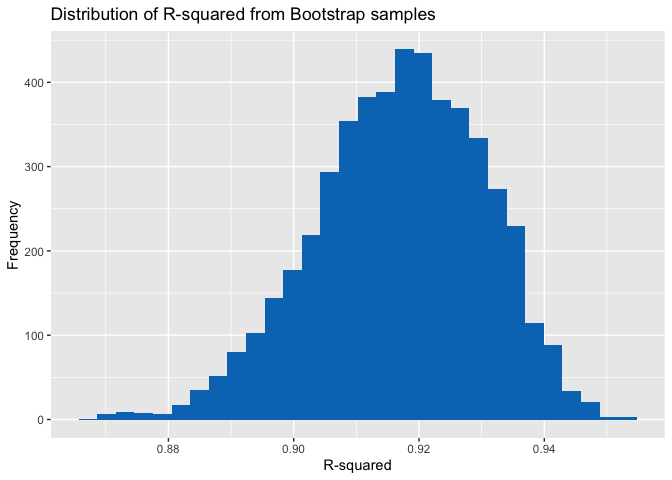

p8105_hw6_rl3411
================
rl3411
2023-11-17

``` r
library(tidyverse)
```

    ## ── Attaching core tidyverse packages ──────────────────────── tidyverse 2.0.0 ──
    ## ✔ dplyr     1.1.3          ✔ readr     2.1.4     
    ## ✔ forcats   1.0.0          ✔ stringr   1.5.0     
    ## ✔ ggplot2   3.4.3          ✔ tibble    3.2.1.9006
    ## ✔ lubridate 1.9.2          ✔ tidyr     1.3.0     
    ## ✔ purrr     1.0.2          
    ## ── Conflicts ────────────────────────────────────────── tidyverse_conflicts() ──
    ## ✖ dplyr::filter() masks stats::filter()
    ## ✖ dplyr::lag()    masks stats::lag()
    ## ℹ Use the conflicted package (<http://conflicted.r-lib.org/>) to force all conflicts to become errors

``` r
library(modelr)
```

# Problem 1

# Problem 2

``` r
weather_df = 
  rnoaa::meteo_pull_monitors(
    c("USW00094728"),
    var = c("PRCP", "TMIN", "TMAX"), 
    date_min = "2022-01-01",
    date_max = "2022-12-31") |>
  mutate(
    name = recode(id, USW00094728 = "CentralPark_NY"),
    tmin = tmin / 10,
    tmax = tmax / 10) |>
  select(name, id, everything())
```

    ## using cached file: /Users/rujinlim/Library/Caches/org.R-project.R/R/rnoaa/noaa_ghcnd/USW00094728.dly

    ## date created (size, mb): 2023-09-28 10:20:02.328587 (8.524)

    ## file min/max dates: 1869-01-01 / 2023-09-30

``` r
boot_sample = function(df){
  
  boot_samp = sample_frac(df, replace = TRUE) 
  model = lm(tmax ~ tmin + prcp, data = boot_samp)
  
  r2 =  model |> 
    broom::glance() |> 
    select(r.squared)
  
  lgb1b2 = model |> 
    broom::tidy() |> 
    filter(term %in% c("tmin", "prcp")) |>
    select(term, estimate) |> 
    pivot_wider(names_from = term,
                values_from = estimate) |> 
    mutate(logb1b2 = log(tmin * prcp)) |> 
    select(logb1b2)
  
  tibble(r2, lgb1b2)
}

boot_straps = 
  tibble(strap_number = 1:5000) |> 
  mutate(
    strap_sample = map(strap_number, \(i) boot_sample(df = weather_df))) |> 
  unnest(strap_sample)
```

    ## Warning: There were 3414 warnings in `mutate()`.
    ## The first warning was:
    ## ℹ In argument: `logb1b2 = log(tmin * prcp)`.
    ## Caused by warning:
    ## ! There was 1 warning in `mutate()`.
    ## ℹ In argument: `logb1b2 = log(tmin * prcp)`.
    ## Caused by warning in `log()`:
    ## ! NaNs produced
    ## ℹ Run `dplyr::last_dplyr_warnings()` to see the 3413 remaining warnings.

``` r
boot_straps |> 
  ggplot(aes(x = r.squared)) +
  geom_histogram(fill = "#0077BE") + 
  labs(
    title = "Distribution of R-squared from Bootstrap samples",
    x = "R-squared",
    y = "Frequency"
  )
```

    ## `stat_bin()` using `bins = 30`. Pick better value with `binwidth`.

<!-- -->

``` r
boot_straps |> 
  drop_na(logb1b2) |> 
  ggplot(aes(x = logb1b2)) +
  geom_histogram(fill = "#0077BE") + 
  labs(
    title = "Distribution of log(beta1 * beta2) from Bootstrap samples",
    x = "Log(beta1 * beta2)",
    y = "Frequency"
  ) 
```

    ## `stat_bin()` using `bins = 30`. Pick better value with `binwidth`.

<!-- -->

``` r
boot_straps |> 
  pivot_longer(
    r.squared:logb1b2,
    names_to = "variable",
    values_to = "estimate"
  ) |> 
  group_by(variable) |> 
  summarize(
    lower_CI = quantile(estimate, 0.025, na.rm = TRUE),
    upper_CI = quantile(estimate, 0.975, na.rm = TRUE)
  ) |> 
  knitr::kable()
```

| variable  |   lower_CI |   upper_CI |
|:----------|-----------:|-----------:|
| logb1b2   | -9.1289296 | -4.5779903 |
| r.squared |  0.8901505 |  0.9408868 |
